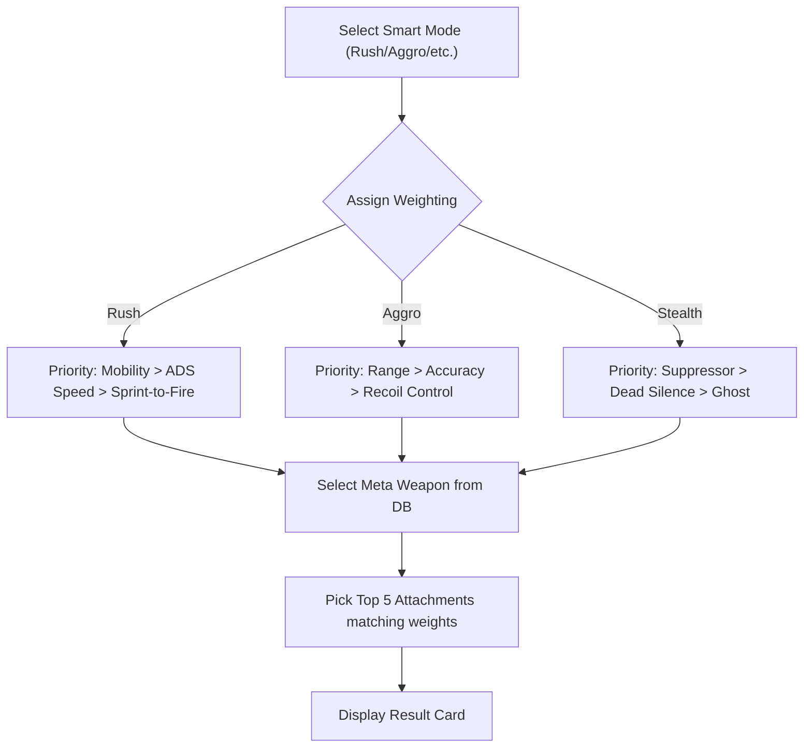

# 【PRD】CODM Loadout Strategist (Windows Edition)

## 1. Version History
| Date | Update | Author |
|---|---|---|
| 2026-05-01 | Initial Draft for Windows Standalone App | remio |

## 2. Business Background
### 2.1 Product Positioning
A high-performance Windows desktop application that empowers CODM players to generate hyper-optimized weapon loadouts based on specific tactical "Smart Modes". 

*   **Do**:
    *   Generate complete loadouts (Weapon + 5 Attachments + Perks + Scorestreaks).
    *   Provide playstyle-specific logic (Rush, Aggro, Passive, Stealth).
    *   Support automated builds via GitHub Actions and seamless editing in Windsurf.
    *   Professional branding with a custom application icon.
*   **Don't**:
    *   Direct game-memory injection (Prevents anti-cheat bans).
    *   Real-time in-game stat monitoring.

### 2.2 Core Scenarios
| Priority | Scenario | User Value |
|---|---|---|
| P0 | Playstyle-Driven Generation | Users select "Rush" and get a SMG/Fast-AR build with high mobility. |
| P0 | Metadata-Based Tiering | App prioritizes "S-Tier" weapons based on current Season meta. |
| P1 | Loadout Export | Copy loadout names and attachment strings to clipboard for manual entry in CODM. |
| P2 | Historical Saves | Save generated loadouts to a local library for later reference. |

## 3. Functional Requirements
### 3.1 Loadout Generation Engine
The core logic mapping playstyles to attachment priorities.

#### Process Flow

#### Feature Details
| Feature | Description | Logic / Interaction | UI Element |
|---|---|---|---|
| Smart Mode Selector | Toggle buttons for Rush, Aggro, Stealth, Tactical. | Updates the generation weights instantly. | Segmented Control |
| Generation Button | The "Roll" action. | Randomly selects a weapon within the Meta pool and adds smart attachments. | Primary Action Button |
| Export String | Copy-pasteable text. | Formats attachment list (e.g., "Muzzle: Monolithic...") to clipboard. | "Copy" Icon |

### 3.2 UI/UX Design (Neo-Brutalist)
*   **Aesthetic Style**: Neo-Brutalist.
*   **Typography**: Bold "Helvetica/Arial" headers.
*   **Borders**: Thick 3px solid black borders.
*   **Shadows**: Heavy 4px hard shadows (offset) on buttons.
*   **Color Palette**: High contrast (Toxic Green #00FF00, Sharp Yellow #FFFF00 on Black/Deep Grey background).

## 4. Technical Specifications
### 4.1 Development Workflow
*   **IDE**: Windsurf (utilizing Cascade Flow Mode).
*   **Framework**: Electron.js or React + Vite (packaged for Windows).
*   **CI/CD**: GitHub Actions.
    *   **Trigger**: Push to `main`.
    *   **Action**: build-windows.yml using `electron-builder` to output a `.exe`.
*   **Assets**:
    *   `assets/icon.ico`: Custom branding icon.
    *   `src/data/weapons.json`: Local database of weapon stats and attachments.

## 5. i18n Copy
| Key | English |
|---|---|
| `mode_rush` | Rush (CQC King) |
| `mode_aggro` | Aggro (Mid-Range Slayer) |
| `generate_btn` | DEPLOY LOADOUT |
| `copy_success` | Loadout copied to tactical tray. |
